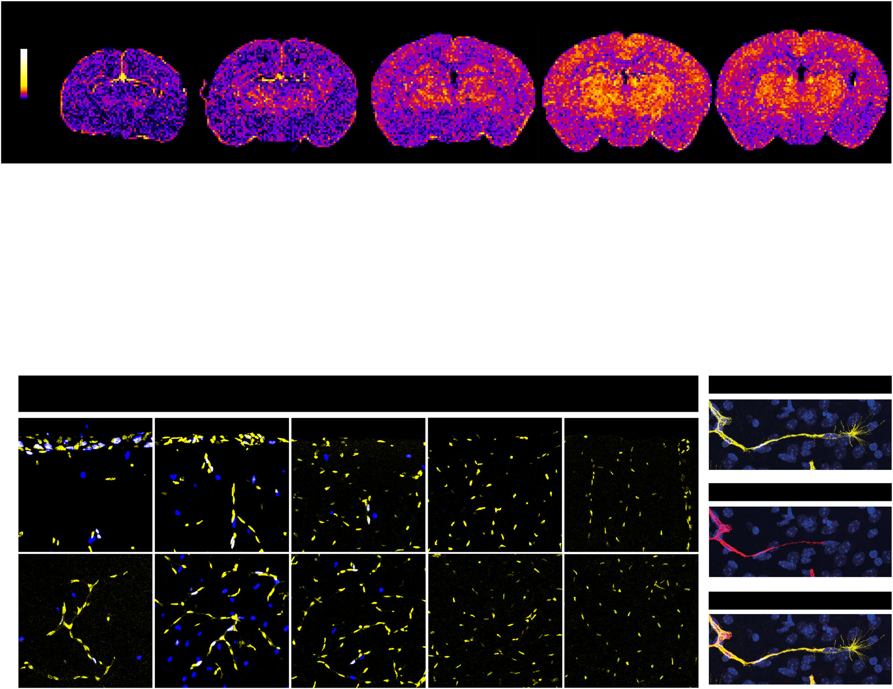
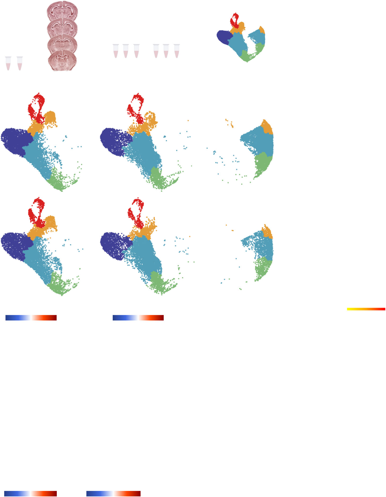
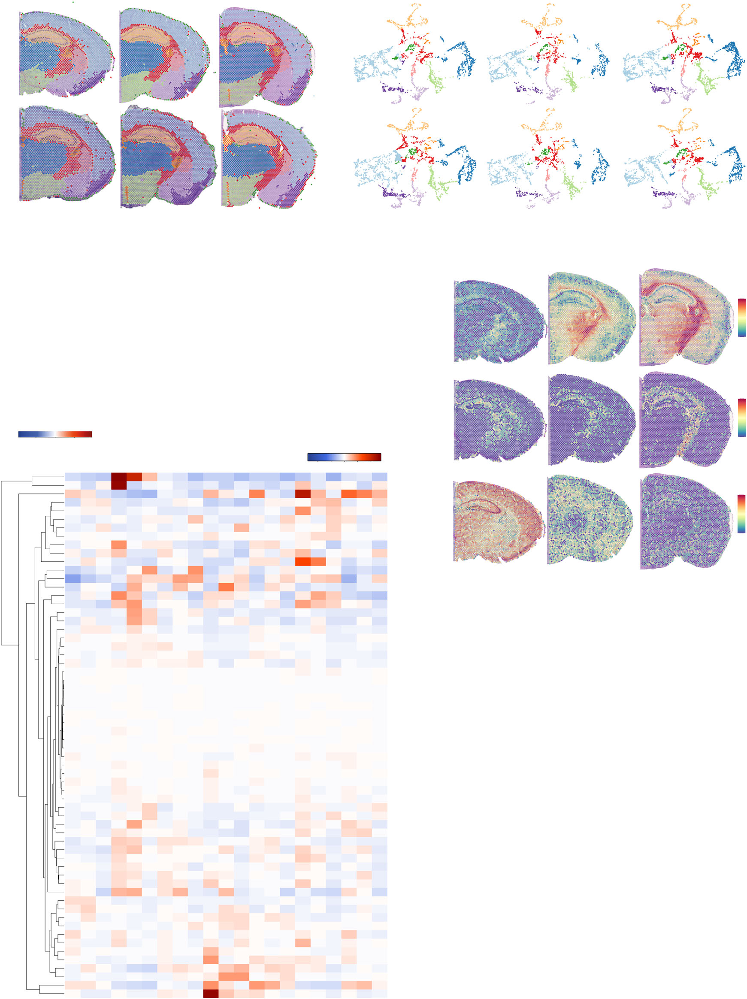
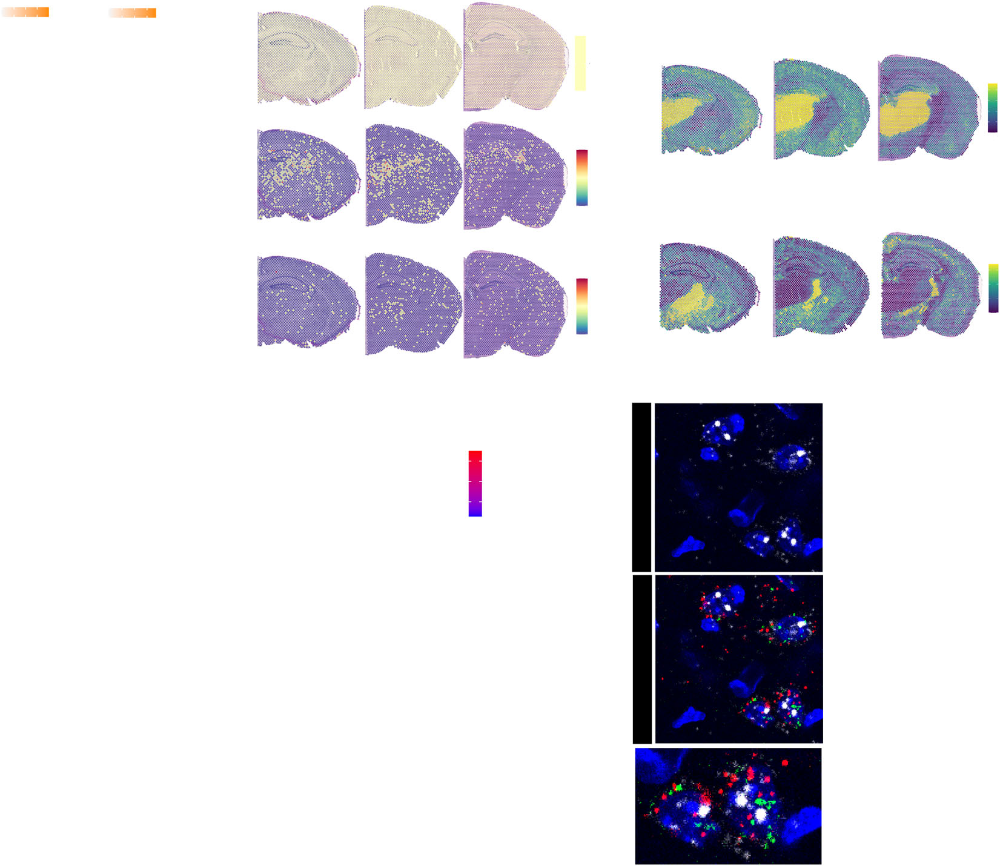
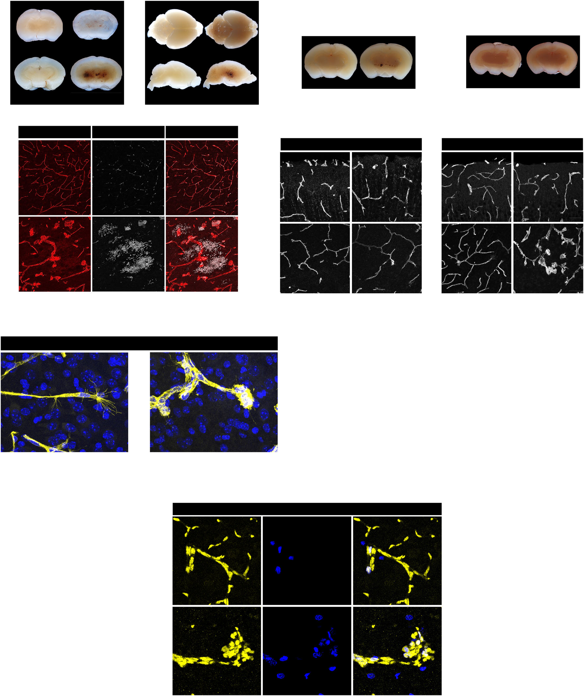
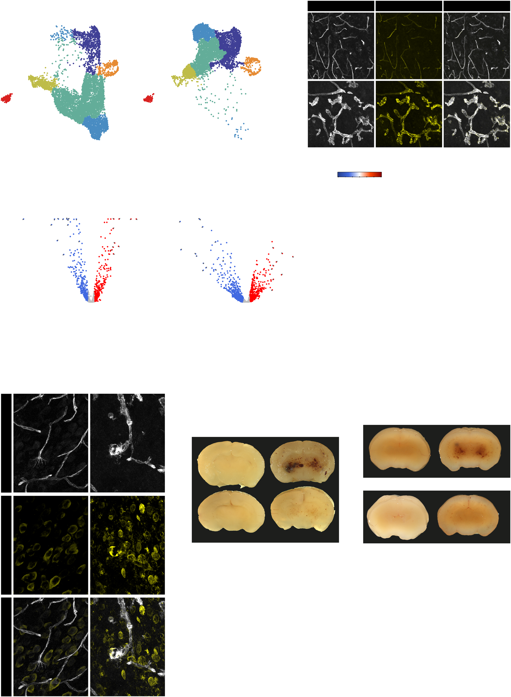

# Figures — Bizou et al. 2026

All six main figures, extracted from
[`../bizou-2026-nvu-angiogenic-programs.pdf`](../bizou-2026-nvu-angiogenic-programs.pdf) with
`references/_tools/extract_pdf_assets.py`. Digest: [`../digest.md`](../digest.md).

> **No `panels/` folder for this paper, deliberately.** Every micrograph is a multi-channel merge
> (vessels yellow + DAPI blue + EdU/other marker), so none is an isolated vessel channel, and no
> pixel size is stated. Reasoning: [`../digest.md`](../digest.md) §5.
>
> **Note:** the figures are extracted as embedded raster images, so the **vector panel letters,
> axis labels and annotations from the PDF are not baked in**. Panel identification below comes
> from the published captions.

---

## Fig 1 — `fig1_regional_vascularization_dynamics.png` ⭐

- **(a)** the part worth studying: **whole-brain vascular-density heatmaps** of coronal sections
  at **P1, P6, P12, P21, P40**, built by segmenting CD31/ICAM2 and tiling into fixed-size squares
  (black→purple→orange→white colour scale). The progressive brightening from P1 to P40 is the
  developmental densification, and the thalamic hot zone in the later sections is the paper's
  main imaging claim. Conceptually the same construct as Rust 2020's grid heatmap, applied at
  whole-brain scale.
- **(b)** vascular density per region, µm²/mm² × 10³, dotted line = whole-brain mean.
- **(c)** ERG (endothelial nuclei) + EdU double labelling — yellow vessels, blue nuclei, white
  EdU⁺ proliferating endothelial cells; a red dotted line marks the pia/parenchyma boundary.
  The two rows are cortex and thalamus across ages.
- **(d, e)** ERG⁺ cells per mm², and the EdU⁺ proliferating fraction.
- **(f)** high-magnification **tip cells** (right-hand column), identified by **CD31⁺/ICAM2⁻
  filopodia** — the fine spray of processes at the vessel tip is clearly visible.
- **(g)** tip cells per mm² of vessel.

## Fig 2 — `fig2_endothelial_heterogeneity_scRNAseq.png`

Region-resolved endothelial scRNA-seq: (a) experimental schematic, (b) UMAP of all ECs across
cortex/thalamus and stages, (c) PCA, (d) differentially expressed genes by subtype/region/age,
(e) angiogenic pathway activity, (f) BBB and transporter pathway activity.

## Fig 3 — `fig3_spatial_angiogenic_signatures.png`

Visium spatial transcriptomics across developing brain regions: cluster maps, UMAPs, marker
feature plots (*Mbp*, *Gfap*, *Tubb2b*, *Rora*) and the region-specific angiogenic expression
landscape.

## Fig 4 — `fig4_NVU_communications.png`

Ligand–receptor interaction analysis across P6, P12 and adult; VEGFA ranked top overall, with the
thalamus-specific neuronal→endothelial **TGFβ2** signal validated by Visium, in-situ
hybridization and the Allen Developing Mouse Brain atlas.

## Fig 5 — `fig5_endothelial_TGFb_signaling.png`

Endothelial TGFβ signalling coordinating postnatal angiogenesis and vascular maturation —
*Tgfbr1* endothelial knockout phenotype.

## Fig 6 — `fig6_mTORC1_inhibition_rescue.png`

mTORC1 inhibition rescues the vascular anomalies in *Tgfβr1^iECKO^* mice; includes the
phospho-S6 / phospho-4EBP1 immunostaining that demonstrates mTOR hyperactivation.
