# Figures — Freitas-Andrade et al. 2022

Native-resolution figure images extracted from
[`../freitas-andrade-2022-pyvane-endothelial-networks.pdf`](../freitas-andrade-2022-pyvane-endothelial-networks.pdf)
with `references/_tools/extract_pdf_assets.py`. Paper digest: [`../digest.md`](../digest.md).
Cropped panels: [`panels/README.md`](panels/README.md). Re-crop with [`crop_panels.py`](crop_panels.py).

**All 13 figures of the paper are here.** Unlike the other papers in this corpus, **not one of
them prints a scale bar** — which is why every extracted panel is declared uncalibrated.

The three most useful are **Fig 5** (the method), **Fig 8** (a reference segmentation) and
**Fig 9** (published measurements = ground truth).

---

## Fig 5 — `fig5_pyvane_pipeline.png` — the method ⭐

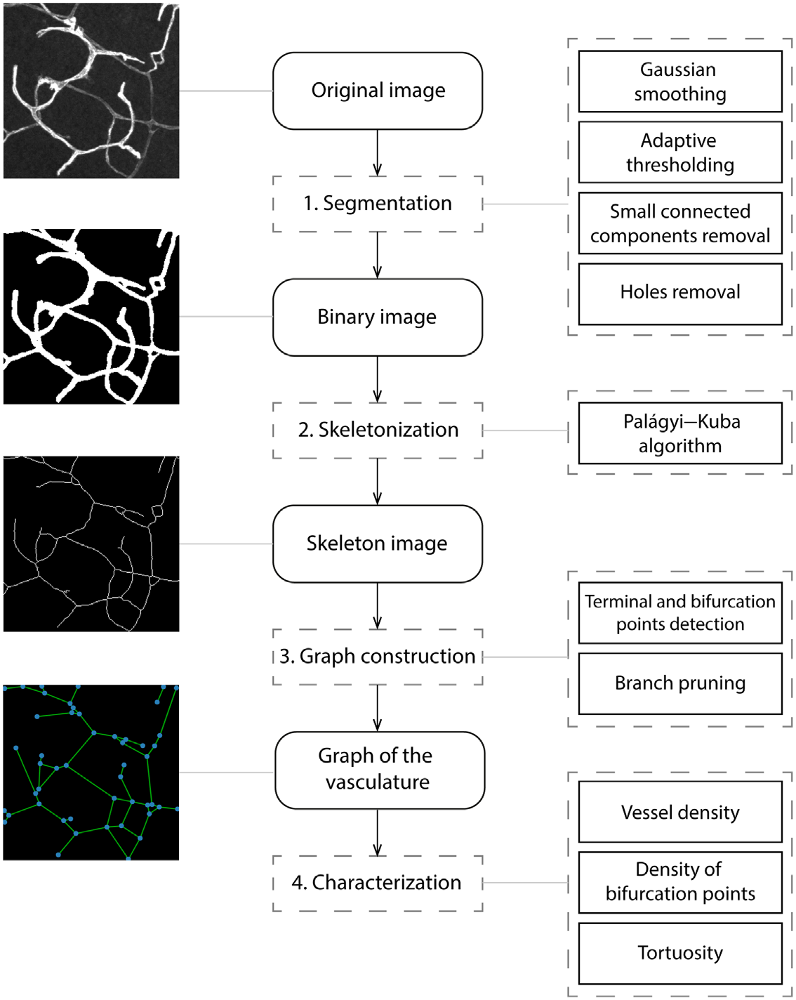

Three columns: example images (left), the four stages (middle), the algorithm used at each
(right). **Segmentation** ← Gaussian smoothing, adaptive thresholding, small-connected-component
removal, hole removal. **Skeletonization** ← Palágyi–Kuba. **Graph construction** ← terminal and
bifurcation point detection, branch pruning. **Characterization** ← vessel density, density of
bifurcation points, tortuosity. Transcribed with all parameters in [`../digest.md`](../digest.md) §2.

## Fig 9 — `fig9_2D_samples_with_measurements.png` — ground truth ⭐

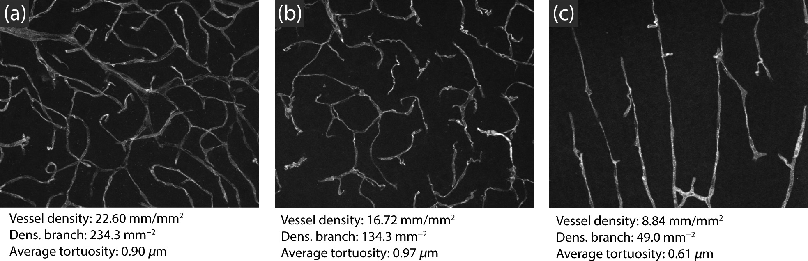

Three 2-D samples, each captioned with the authors' own numbers: (a) VD 22.60 mm/mm², branch
234.3 mm⁻², tortuosity 0.90 µm; (b) 16.72, 134.3, 0.97; (c) 8.84, 49.0, 0.61. (a) is a dense
mesh, (b) sparse and fragmented-looking, (c) dominated by long straight parallel vessels — hence
its low tortuosity. **The only external per-image ground truth in the whole corpus.** Our
pipeline's result on these three: [`../digest.md`](../digest.md) §5.

## Fig 8 — `fig8_2D_worked_example.png` — a reference segmentation ⭐

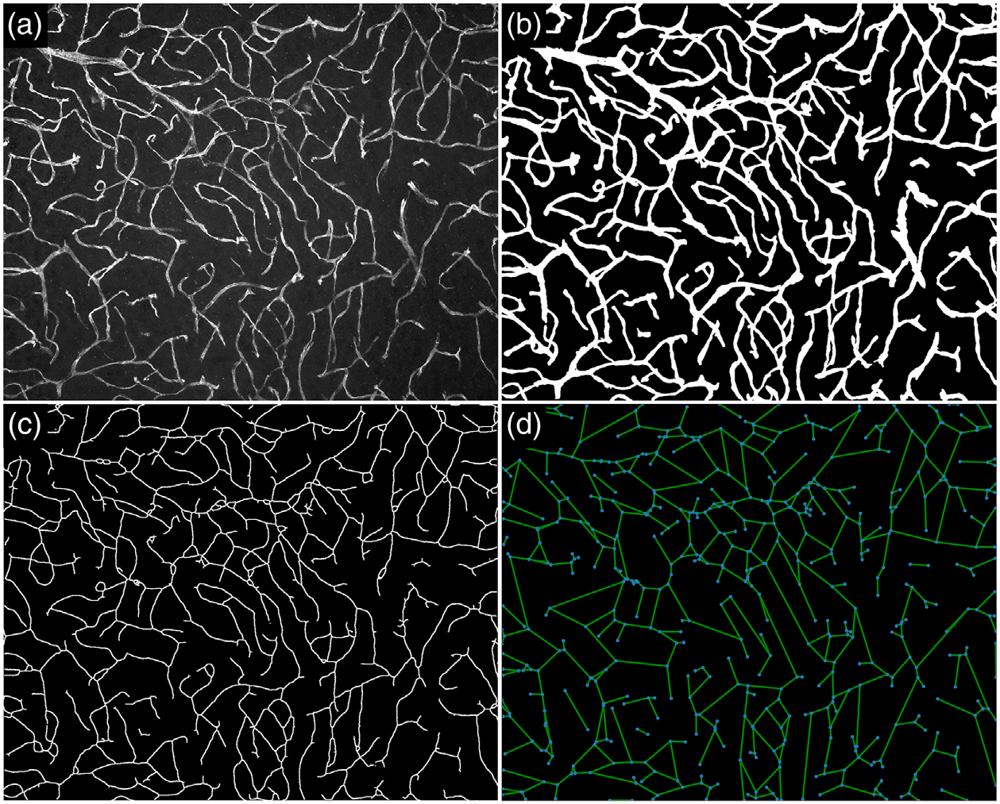

(a) original, (b) the authors' binary mask, (c) their skeleton, (d) their graph (blue nodes =
bifurcations and terminations, green edges). Useful as a *visual* target: run our segmentation on
(a) and compare the mask to (b) and the skeleton to (c). Note in (d) how sparse the graph looks
relative to (c) — that is the pruning at work.

## Fig 3 — `fig3_2D_MIP_and_skeleton.png`

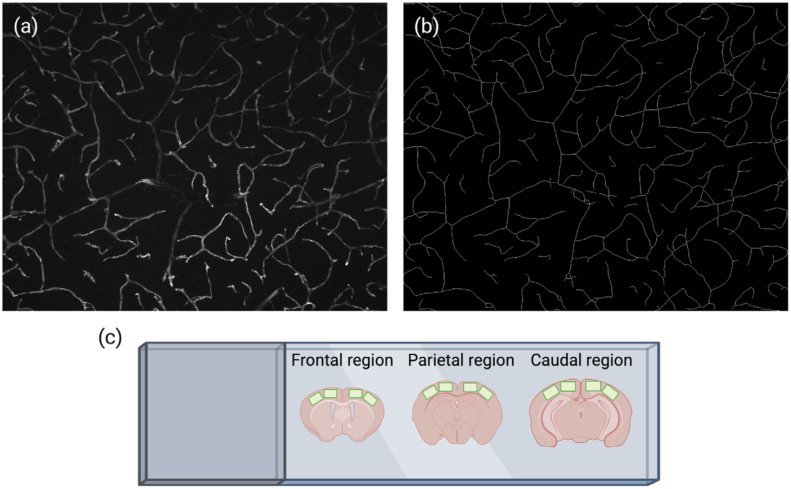

(a) maximum-intensity projection of a 10 µm-deep CD31 z-stack; (b) the skeleton of it, which the
caption argues "clearly captures all vessels within the 10 µm depth"; (c) a BioRender schematic
of the frontal / parietal / caudal cortical regions sampled. Another original+skeleton reference
pair.

## Fig 13 — `fig13_local_tortuosity.png`

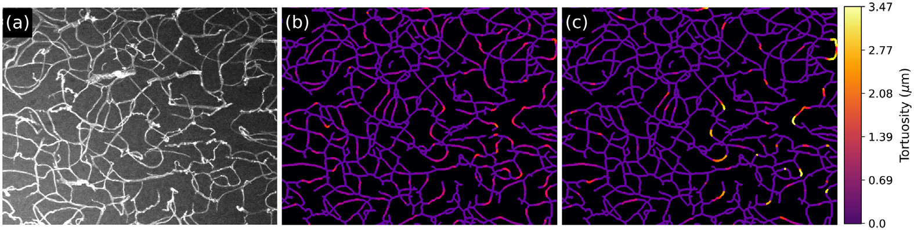

(a) original grayscale vessels; (b) per-pixel tortuosity at **d = 10 µm**; (c) at **d = 20 µm**,
both on a black→purple→orange→white colour scale topping out at 3.47 µm. The small scale picks out
sharp kinks; the large scale picks out long smooth bends. **Visual note:** (a) has a noticeably
*bright, textured grey background* compared with the other originals — which is exactly why our
segmentation over-detects on it (see [`panels/README.md`](panels/README.md)).

## Fig 7 — `fig7_tortuosity_method.png`

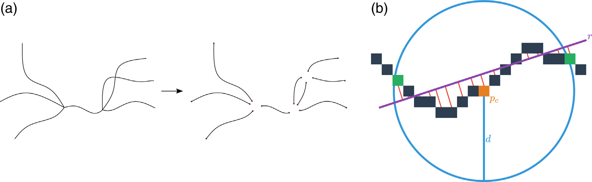

(a) skeleton split into segments; (b) the per-pixel construction — reference pixel *pc* in
orange, its circular neighbourhood, the least-squares line *r* in purple, and the red distances
whose mean is the tortuosity value.

## Fig 6 — `fig6_branch_pruning.png`

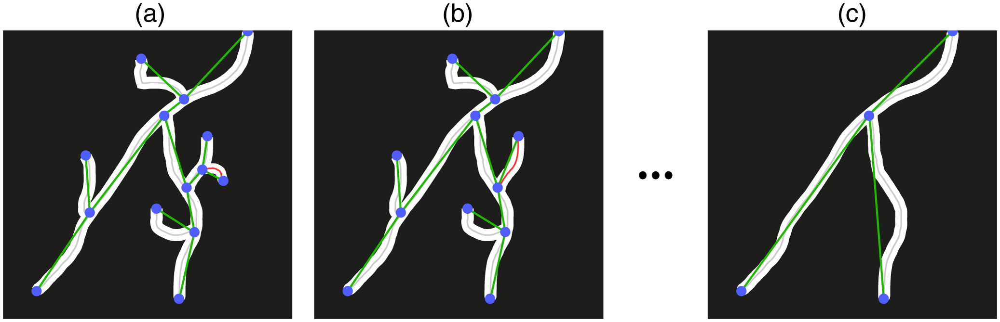

The iterative prune: (a) smallest branch found (red), (b) removing it exposes a new branch, also
below threshold, (c) the settled result.

## Fig 10 / 11 / 12 — 3-D

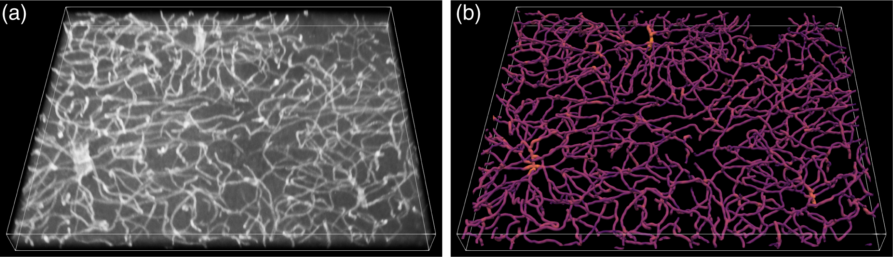

`fig10_3D_reconstruction.png` — (a) a raw 3-D stack, (b) the detected vessels rendered with
colour encoding **diameter** (brighter = thicker).

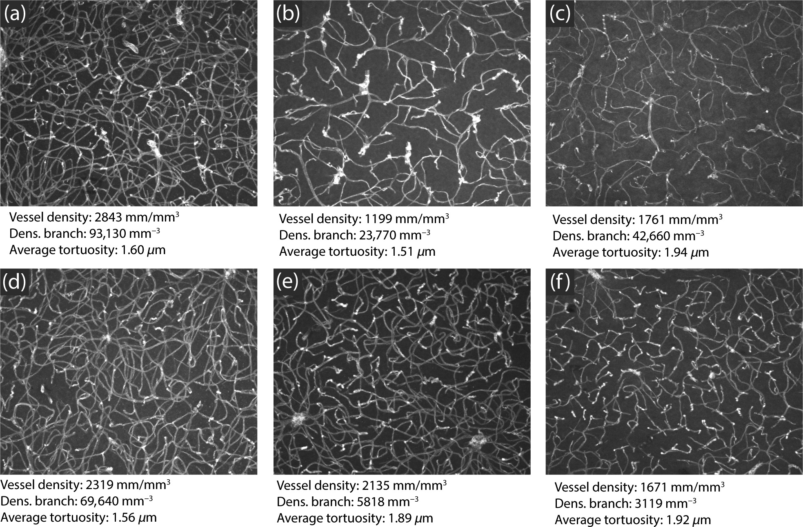

`fig11_3D_samples.png` — six 3-D samples (shown as maximum Z-projections) spanning the density
and tortuosity range: (a) highest density, (b) lowest, (c) most tortuous, (d) least, (e)/(f)
intermediate.

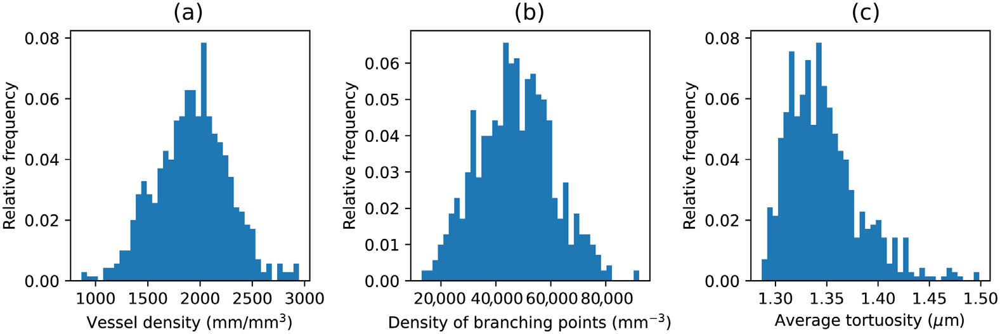

`fig12_measurement_distributions.png` — distributions of (a) vessel density, (b) branching-point
density and (c) average tortuosity over **324** 3-D stacks. Density distributions symmetric;
tortuosity right-skewed.

## Fig 1 / 2 / 4 — protocol context

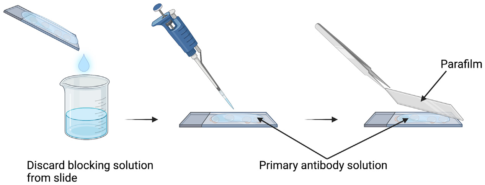

`fig1_antibody_incubation_slide.png` — a slide covered with parafilm during overnight primary
antibody incubation (the trick that lets a small antibody volume cover the whole section).

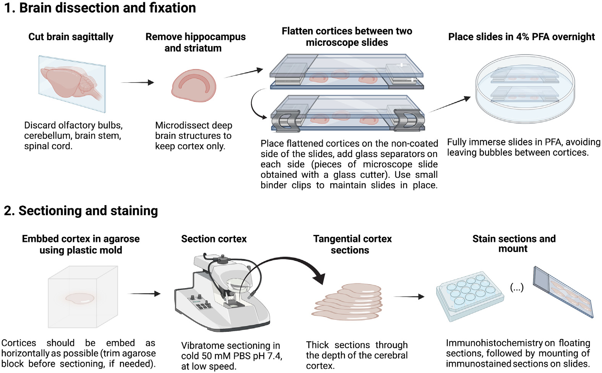

`fig2_vibratome_prep.png` — halving the brain, mounting and vibratome-sectioning the cortex for
the 3-D route.

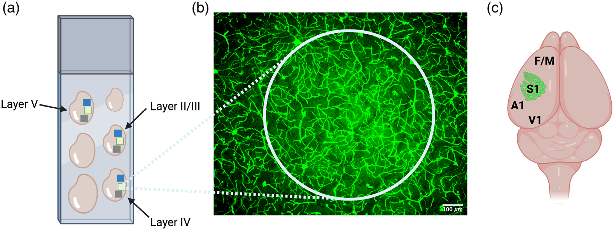

`fig4_tangential_cortex_regions.png` — (a) tangential serial cortex sections with anterior/
parietal/occipital regions boxed; (b) layer IV barrel cortex made visible by pushing exposure on
background autofluorescence; (c) using S1 as a landmark for frontal/motor, auditory and visual
cortex.
