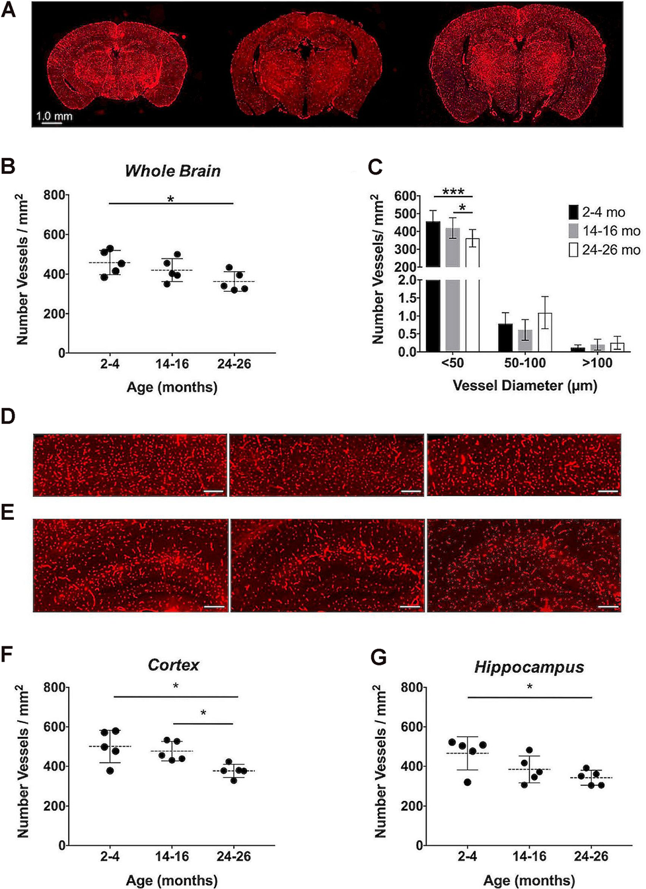
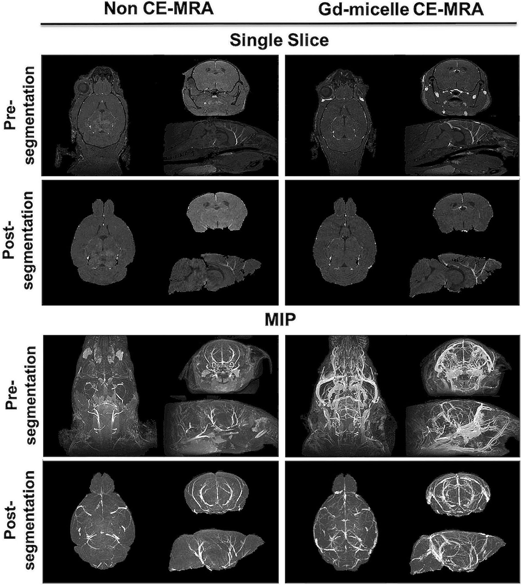
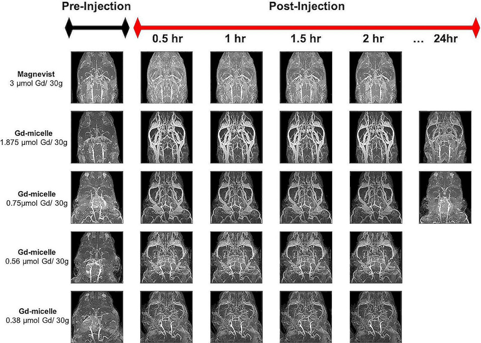
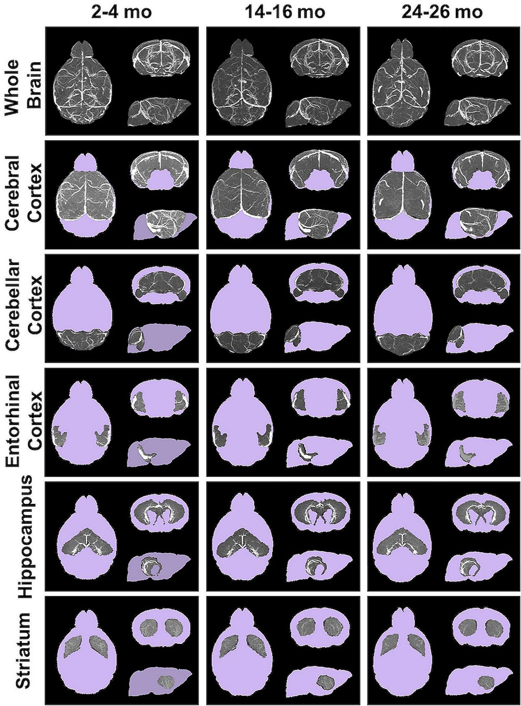
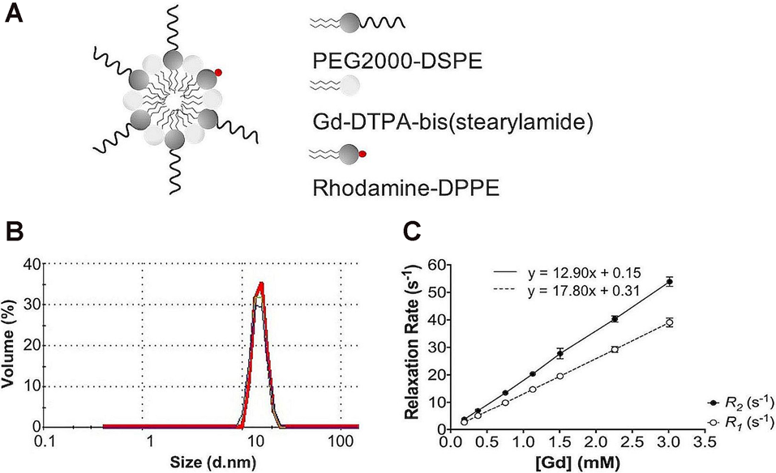
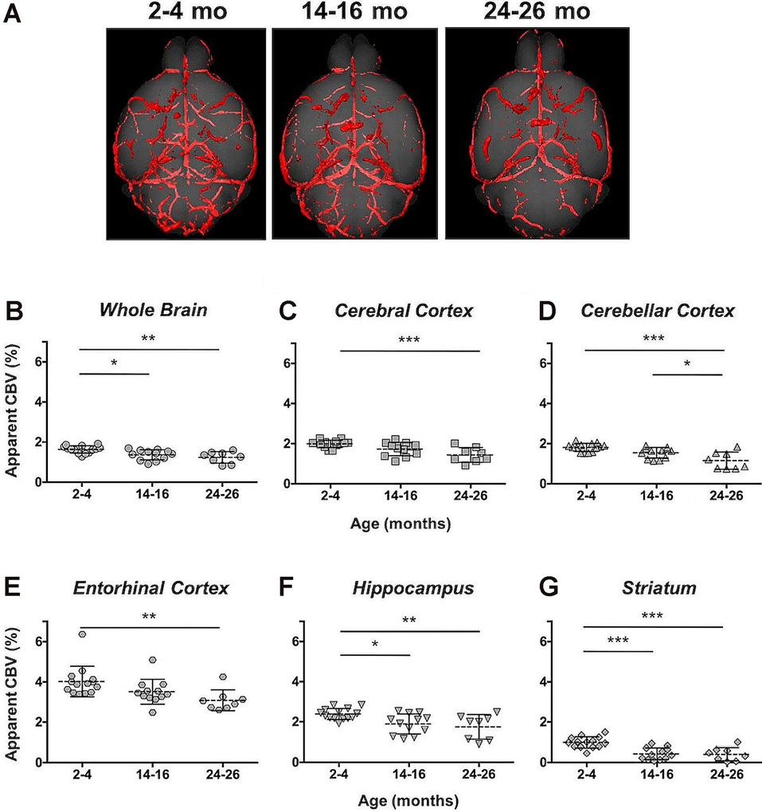
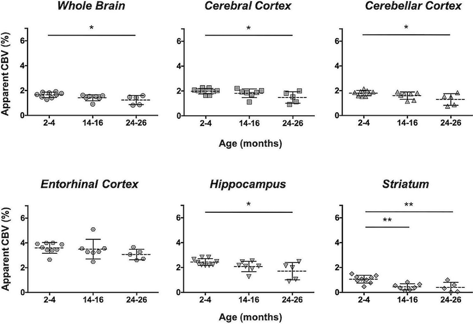
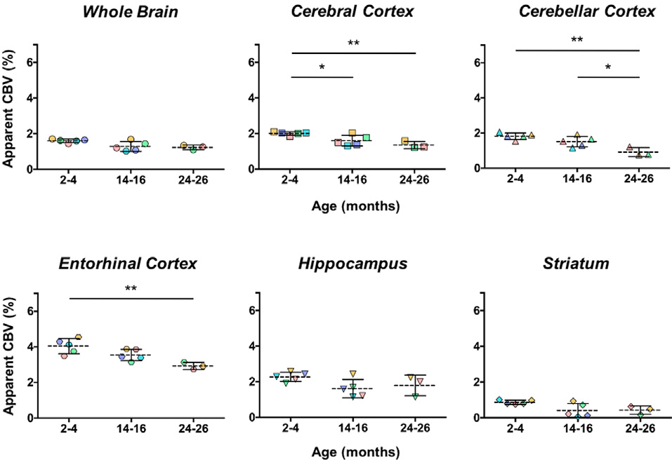
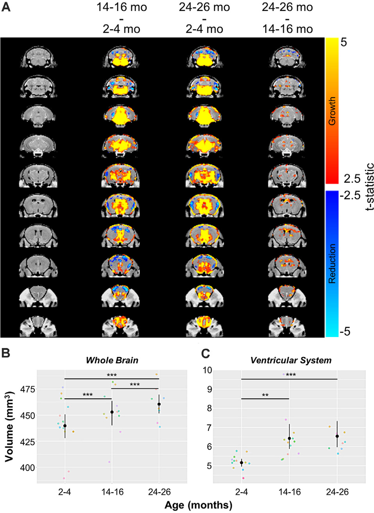

# Figures — Hill et al. 2020

All nine figures, extracted from
[`../hill-2020-aging-mra-cerebrovascular-loss.pdf`](../hill-2020-aging-mra-cerebrovascular-loss.pdf)
with `references/_tools/extract_pdf_assets.py`. Digest: [`../digest.md`](../digest.md).

> **No `panels/` folder for this paper, deliberately.** This is MR angiography at (100 µm)³
> voxels, not fluorescence microscopy — a different modality at a different scale, with no
> fluorescence channel to isolate. The one optical figure (Fig 9) is whole-slide-scanned 5 µm
> paraffin CD31 histology, shown as small composite thumbnails. Reasoning: [`../digest.md`](../digest.md) §5.

---

## Fig 9 — `fig9_CD31_IHC_vascular_density.png` ⭐ the one that matters to us

Immunohistochemical validation of the MRA finding. (A) representative CD31-stained sections at
2–4, 14–16 and 24–26 months; (B, C) vessels/mm² through the whole section and per ROI. The
numbers — **458 ± 61 → 362 ± 49 vessels/mm²** over two years — are the reference count density
quoted in the digest.

## Fig 3 — `fig3_highres_MRA_with_without_micelle.png`

High-resolution MRA with and without the Gd-micelle agent. The cleanest demonstration of what
the contrast agent buys: the cerebrovascular tree becomes visible as a connected structure. Worth
a look purely as a reminder of what "vasculature" looks like at 100 µm voxels versus the confocal
panels we work on — the entire capillary bed we spend our time segmenting is below this
resolution.

## Fig 2 — `fig2_timecourse_CE_MRA.png`

Time-course CE-MRA following micelle injection, showing the enhancement window the protocol
depends on.

## Fig 4 — `fig4_segmented_brain_ROIs.png`

Brain regions of interest segmented automatically by registration to the Dorr et al. (2008)
atlas — the mechanism behind every per-region number in the paper.

## Fig 1 — `fig1_gd_micelle_characterization.png`

Gd-micelle schematic and characterization (hydrodynamic diameter 15.63 ± 0.58 nm).

## Figs 5–7 — aCBV quantification

`fig5_aCBV_total_cohort.png` — apparent CBV for the whole C57BL/6 cohort, whole brain and by
region, across the three age groups.

`fig6_aCBV_longitudinal_C57BL6NTac.png` — the longitudinally imaged C57BL/6NTac sub-cohort (the
values tabulated in [`../digest.md`](../digest.md) §3); note the steeper decline in the first year.

`fig7_aCBV_C57BL6N.png` — the separate C57BL/6N group, excluding the longitudinal cohort.

## Fig 8 — `fig8_volumetric_changes.png`

Deformation-based morphometry: voxel-wise volumetric growth (red-to-yellow) and reduction
(blue-to-cyan) between age groups, plus whole-brain and ventricular-system volume changes.
