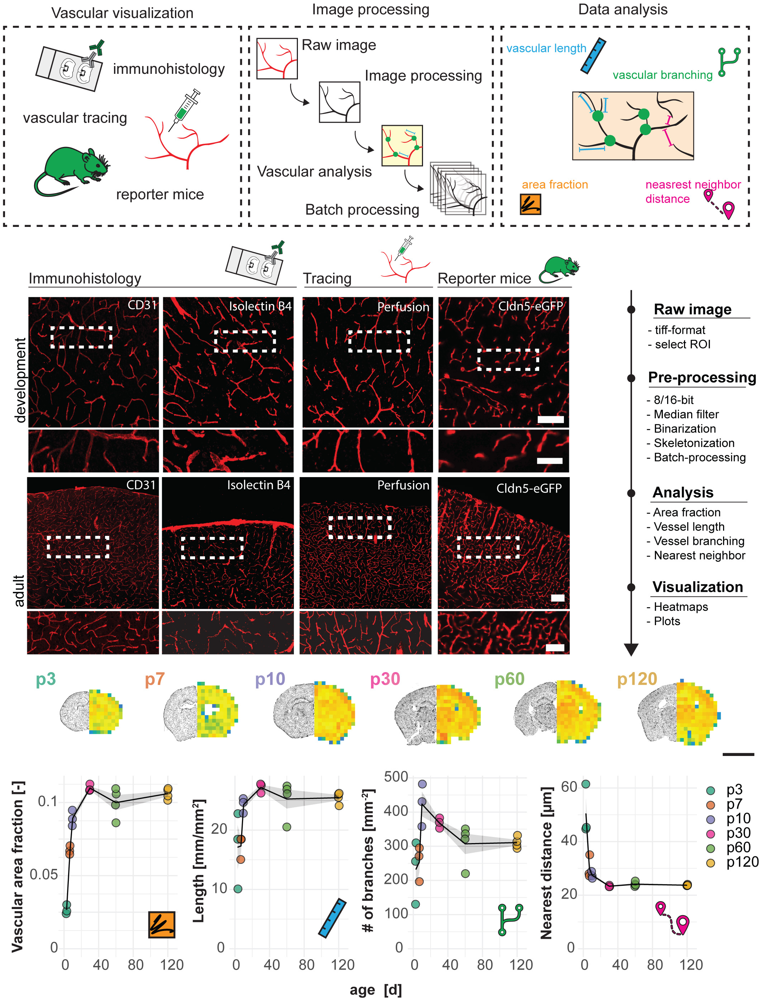
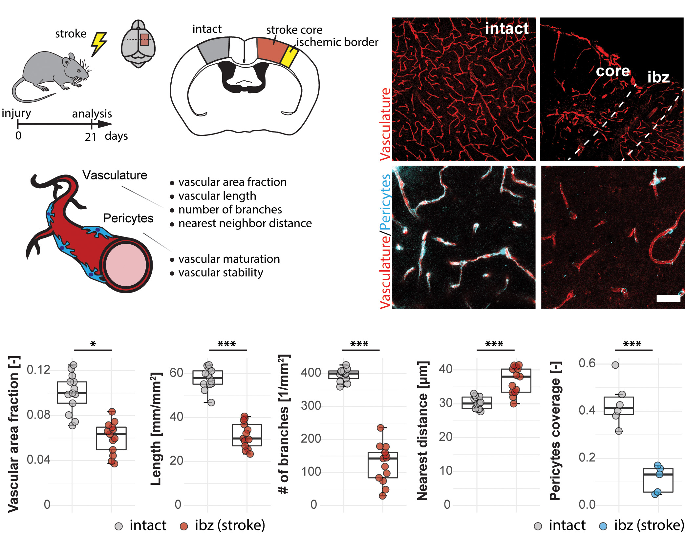
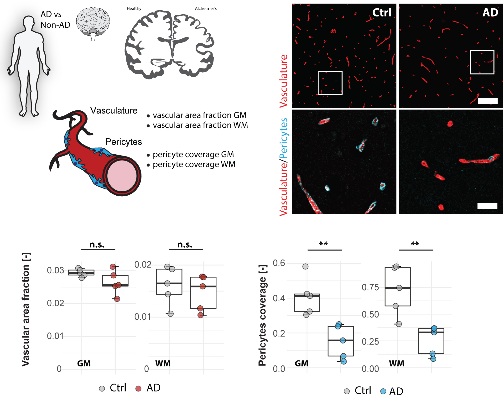

# Figures — Rust et al. 2020

Native-resolution figure images extracted from
[`../rust-2020-fiji-vascular-analysis.pdf`](../rust-2020-fiji-vascular-analysis.pdf) with
`references/_tools/extract_pdf_assets.py`. Paper digest: [`../digest.md`](../digest.md).
Cropped sub-panels and the working-dataset inventory: [`panels/README.md`](panels/README.md).
The authors' supplementary toolbox and their calibrated representative image are in
[`../supplementary/`](../supplementary/) — see [`../digest.md`](../digest.md) §7.

The PDF embeds each figure as a single JPEG; there are only three (the paper's other exhibits
are supplementary and not in the file). Re-crop the panels with
[`crop_panels.py`](crop_panels.py).

---

## Figure 1 — `fig1_pipeline_development.png` (2120 × 2787)

**The most useful figure in the paper for us.** Four sub-panels:

- **A — experimental design.** Schematic: the three visualization routes (immunohistology,
  vascular tracing, reporter mice) → image processing (raw → processed → analysed → batch) →
  data analysis (the four parameters, each with the icon reused in the plots: orange = area
  fraction, blue = vascular length, green = branching, magenta = nearest-neighbour distance).
- **B — the vessel images**, 4 markers × 2 ages × (overview + close-up strip) = **16 panels**,
  all isolated red vessel channel on black. Columns: **CD31** (immuno), **Isolectin B4**
  (lectin histofluorescence), **Perfusion** (Lectin-DyLight594), **Cldn5-eGFP** (reporter).
  Rows: **development** (p10) and **adult** (3 months); the thin strip beneath each row is the
  magnified content of that row's white dashed box. Scale bar 50 µm (drawn in the rightmost
  column only). **These 16 are cropped into the working dataset.**
- **C — the step-by-step pipeline** (right-hand vertical flow): Raw image → Pre-processing →
  Analysis → Visualization, with the sub-steps listed. **This is the paper's method and it
  exists only as pixels** — transcribed into [`../digest.md`](../digest.md) §2.
- **D — results:** coronal heatmaps at p3/p7/p10/p30/p60/p120 (grid-square area fraction,
  blue→yellow) beside the matching Nissl outline, then the four quantification scatter plots
  vs age. Scale bar 2 mm.

**What we see in panel B (visual notes, for QA):** the development row is a sparse, wide-mesh
network with large avascular gaps and visible sprout-like tips; the adult row is a dense, fine,
regular mesh. **Every adult panel includes the cortical surface** — the bright thick pial vessel
band along the top edge — which is a real anatomical structure, not an artefact, but it will
inflate area %, mean width and the artery count for those four panels. The white dashed ROI
boxes and the white marker labels are figure annotations; the pipeline's red-dominance
segmentation excludes them.

---

## Figure 2 — `fig2_stroke_periinfarct.png` (2090 × 1625)

Mouse **photothrombotic stroke**, analysed 3 weeks post-injury.

- **A — design:** injury→analysis timeline (0→21 days), a coronal schematic marking **intact**
  (grey), **stroke core** (orange) and **ischemic border** (yellow), and the
  vasculature/pericyte cartoon listing which metric belongs to which compartment.
- **B — images**, 2 × 2:
  - *top row, vessel channel only:* **intact** cortex (dense mesh) and the **core / ibz**
    field, where white dashed lines drawn on the figure mark the core↔ibz boundary. The
    vascular dropout across that boundary is obvious by eye.
  - *bottom row, vasculature (red) + pericytes (cyan, CD13):* intact and ibz close-ups.
  - Captioned 100 µm (overview) / 20 µm (close-up) — but **the overview row draws no bar**;
    see [`../digest.md`](../digest.md) §5.
- **C — five boxplots:** area fraction, length, branch count, nearest distance, pericyte
  coverage; intact vs ibz. All significant; numbers in the digest §4b.

---

## Figure 3 — `fig3_human_alzheimers.png` (2113 × 1660)

Human post-mortem **medial frontal cortex**, 5 Alzheimer's vs 5 age-matched controls.

- **A — design:** AD vs non-AD schematic.
- **B — images**, 2 × 2: *top row* vessel channel only (biotinylated lectin), **Ctrl** and
  **AD**, each with a white ROI square marking the close-up; *bottom row* vasculature (red) +
  pericytes (cyan, PDGFR-β). Bars 100 µm (overview) / 20 µm (close-up), both drawn.
- **C — four boxplots:** area fraction (GM, WM) and pericyte coverage (GM, WM), Ctrl vs AD.
  Area fraction n.s.; pericyte coverage significantly reduced in AD (both GM and WM).

**Visual note:** these human panels look nothing like the mouse ones — **5 µm paraffin sections
cut vessels in cross-section**, so the field is mostly small bright ellipses and short
fragments rather than a connected mesh. Any *connectivity* metric (branch count, junctions) is
close to meaningless here; area fraction is the metric the authors actually report for human
tissue, and that is not an accident.
