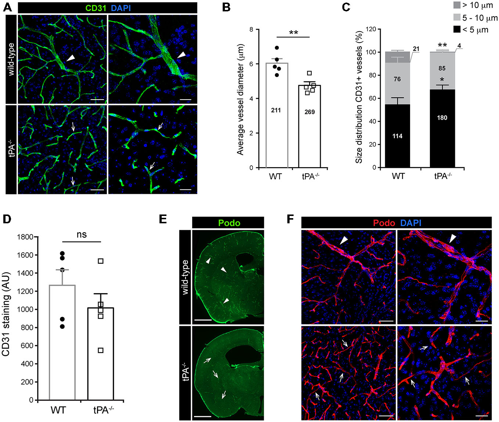
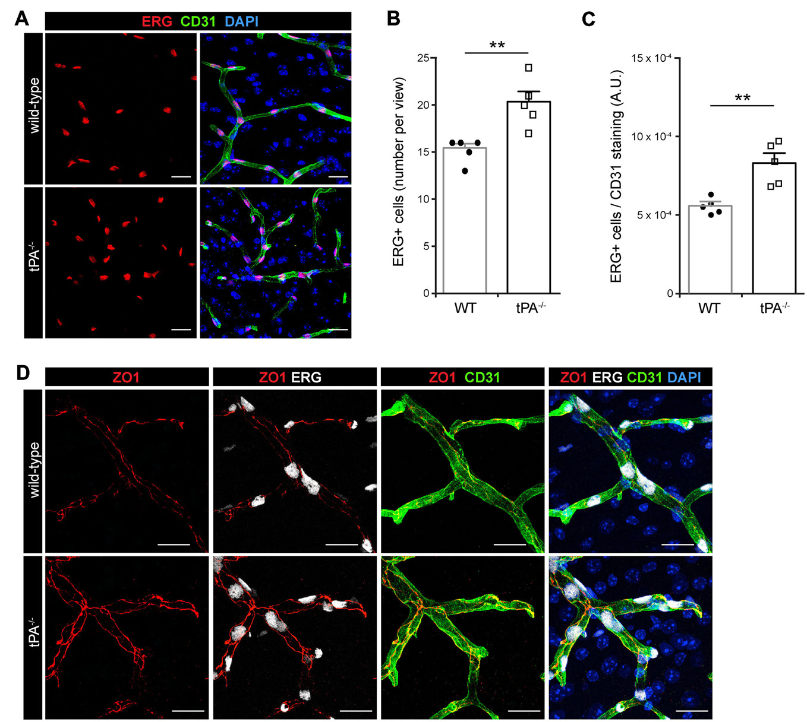
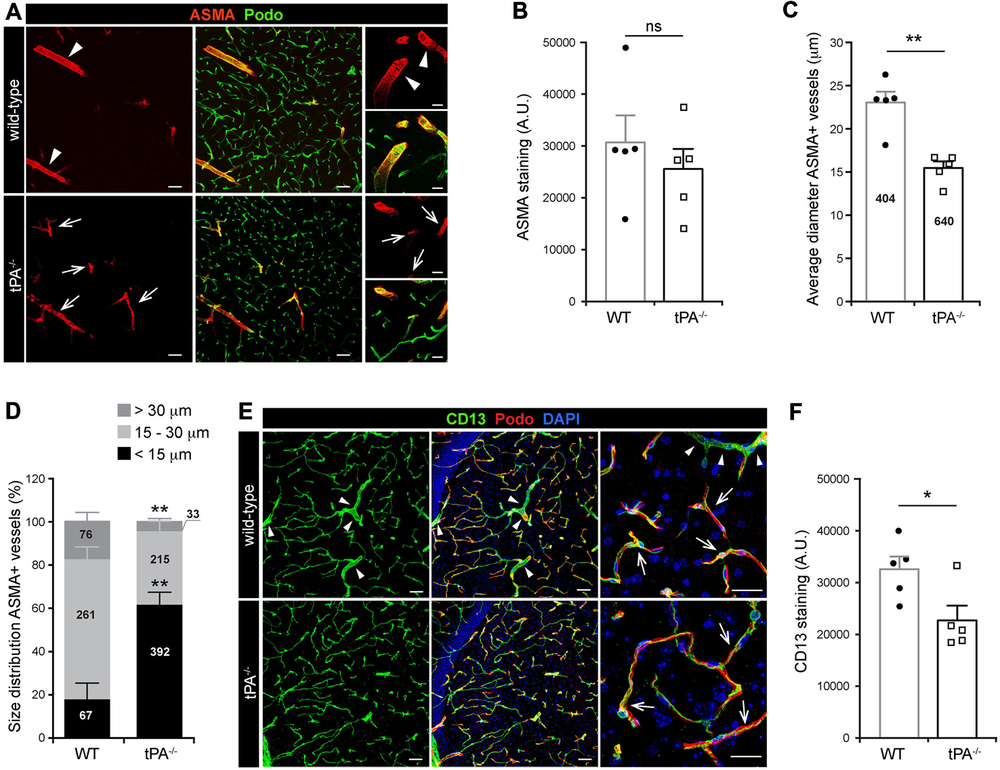
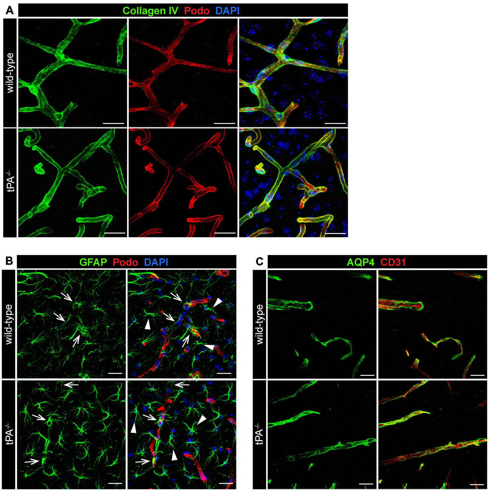
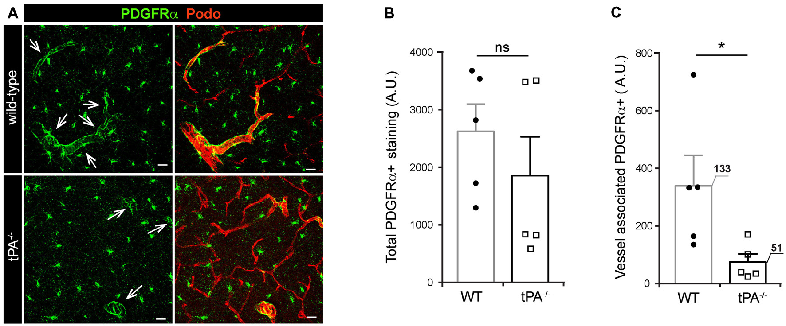
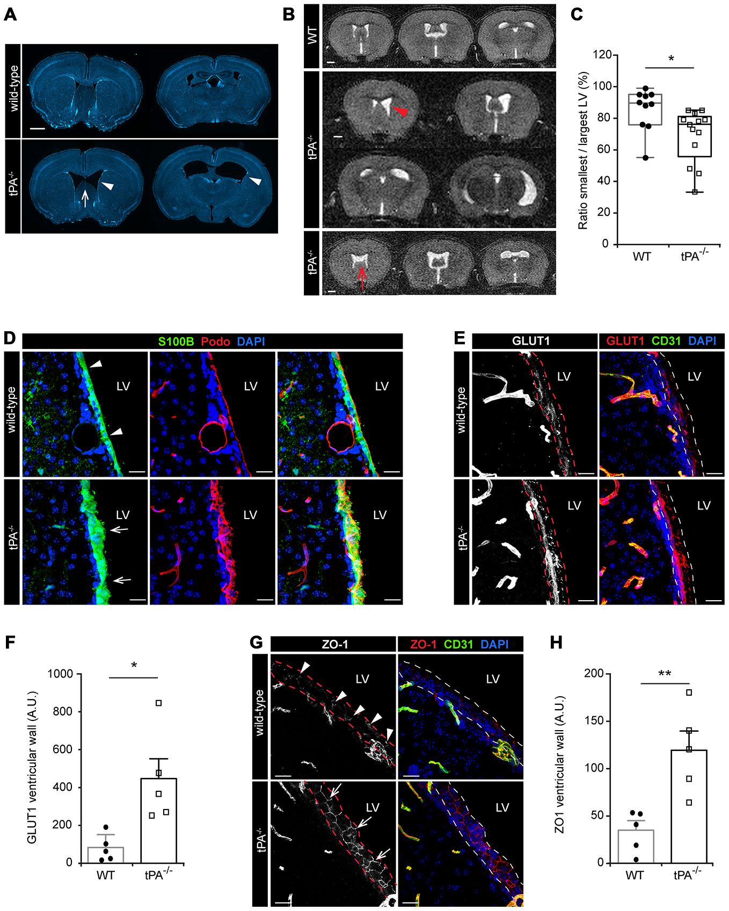

# Figures — Stefanitsch et al. 2015

All six figures, extracted from
[`../stefanitsch-2015-tpa-cerebrovascular-tree.pdf`](../stefanitsch-2015-tpa-cerebrovascular-tree.pdf)
with `references/_tools/extract_pdf_assets.py`. Digest: [`../digest.md`](../digest.md).

> **There is no `panels/` folder for this paper, deliberately.** Every micrograph here is a
> two-channel merge (vessel marker + DAPI nuclei, sometimes a third marker), so none qualifies as
> an isolated vessel channel, and the paper states no pixel size to calibrate with. The reasoning
> is in [`../digest.md`](../digest.md) §5. The value of this paper is its **caliber numbers**,
> not its images.

Scale bars, where stated: Figs 1A/1F/3A/3E left+middle panels **50 µm**, right panels **20 µm**;
Figs 2, 4, 5 and 6D/E/G **20 µm**; Figs 1E, 6A/6B **1 mm**.

---

## Fig 1 — `fig1_CD31_podocalyxin_vessel_calibre.png` ⭐

**The figure behind the caliber reference numbers.**
- **(A)** CD31 (green) + DAPI (blue), wild-type (top) vs tPA⁻/⁻ (bottom), two magnifications.
  **Arrowheads** mark the thick, large-diameter vessels present in WT; **arrows** mark the small
  vessels that dominate tPA⁻/⁻. The visual difference is genuinely obvious — WT has continuous
  thick trunks running through the field, tPA⁻/⁻ has short thin fragments.
- **(B)** average vessel diameter, WT 6.03 vs tPA⁻/⁻ 4.75 µm (n = 211 / 269 vessels, printed on
  the bars).
- **(C)** stacked size distribution in three bins — **< 5 µm** (black), **5–10 µm** (light grey),
  **> 10 µm** (dark grey) — with vessel counts printed inside each segment (WT 114/76/21;
  tPA⁻/⁻ 180/85/4).
- **(D)** total CD31 staining intensity, n.s.
- **(E)** whole-hemisphere podocalyxin tiling; **(F)** podocalyxin (red) + DAPI close-ups
  confirming the same shift with an independent endothelial marker.

**Why the three-bin scheme matters to us:** < 5 / 5–10 / > 10 µm is a published, biologically
motivated caliber binning for CD31⁺ mouse cortical vessels. Our CATEGORIZE ask currently uses a
single pixel-valued threshold — see [`../digest.md`](../digest.md) §1 for what that threshold
actually works out to in µm, and why it looks wrong.

## Fig 2 — `fig2_ERG_ZO1.png`

(A) ERG staining — endothelial nuclei as discrete puncta along vessels; (B, C) counts of ERG⁺
nuclei, raw and normalized to CD31 intensity, both significantly higher in tPA⁻/⁻; (D) ZO1 tight
junctions, more strongly junctional in tPA⁻/⁻.

## Fig 3 — `fig3_ASMA_CD13_mural_cells.png` ⭐

(A) **ASMA** (smooth muscle) with podocalyxin and DAPI — arrowheads on the big
smooth-muscle-covered arteries of WT, arrows on the small ASMA⁺ vessels that replace them in
tPA⁻/⁻. (B) total ASMA amount, n.s. (C) mean ASMA⁺ diameter, 22.9 → 15.4 µm. (D) size
distribution, bins **< 15 µm** and **> 30 µm**. (E) **CD13** — pericytes on capillaries (arrows)
plus vSMC on large vessels (arrowheads), the latter essentially gone in tPA⁻/⁻; (F) resulting
CD13 reduction.

**Useful to look at directly** when thinking about the capillary-vs-artery distinction: this is
what an artery with real smooth-muscle coverage looks like beside the capillary bed, at 20–50 µm
scale bars.

## Fig 4 — `fig4_collagenIV_GFAP_AQP4.png`

The negative control result: (A) collagen IV basement membrane, (B) GFAP astrocytes,
(C) AQP4 perivascular endfeet — all normal in tPA⁻/⁻. Worth keeping as an example of what
*non*-vascular perivascular signal looks like in the same tissue.

## Fig 5 — `fig5_PDGFRa_perivascular.png`

(A) PDGFRα staining with podocalyxin and DAPI, arrows on PDGFRα⁺ vessels; (B) total PDGFRα, n.s.;
(C) perivascular PDGFRα, significantly reduced.

## Fig 6 — `fig6_ventricular_defects.png`

(A) DAPI-stitched coronal sections showing lateral-ventricle asymmetry and hypoplastic septum;
(B) **in vivo 7 T MRI** montage, WT vs two tPA⁻/⁻ mice; (C) ventricular size-ratio box plot;
(D–H) ependymal lining — S100B/podocalyxin, GLUT1 and ZO1, with quantification between the
dashed lines. Not vascular-quantification material, but it is the paper's second main claim.
