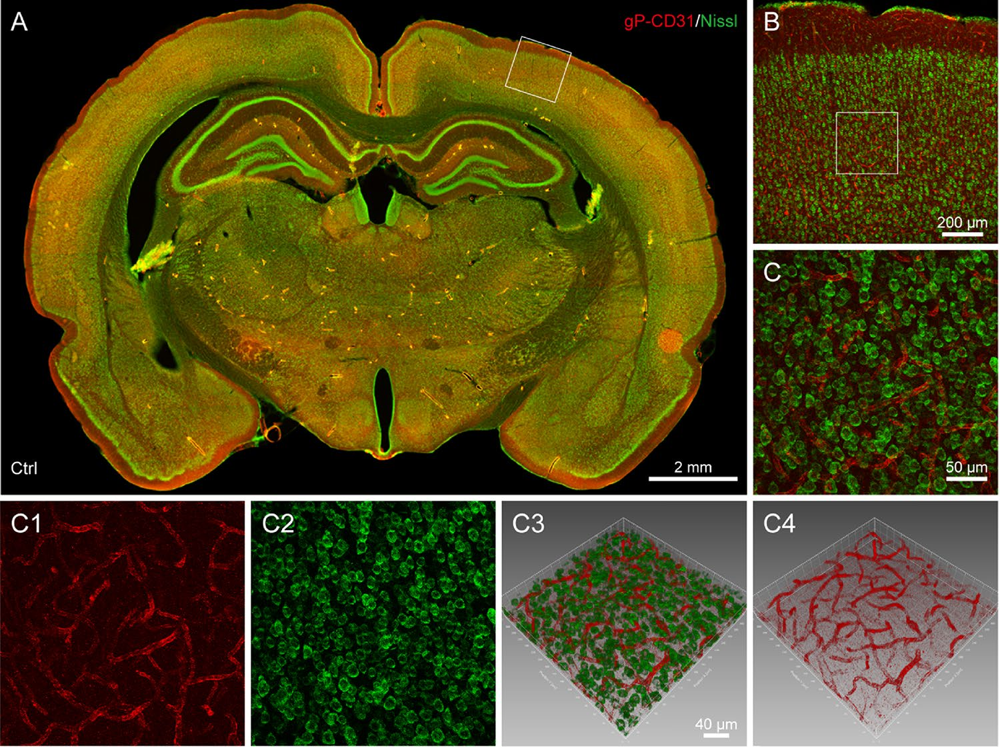
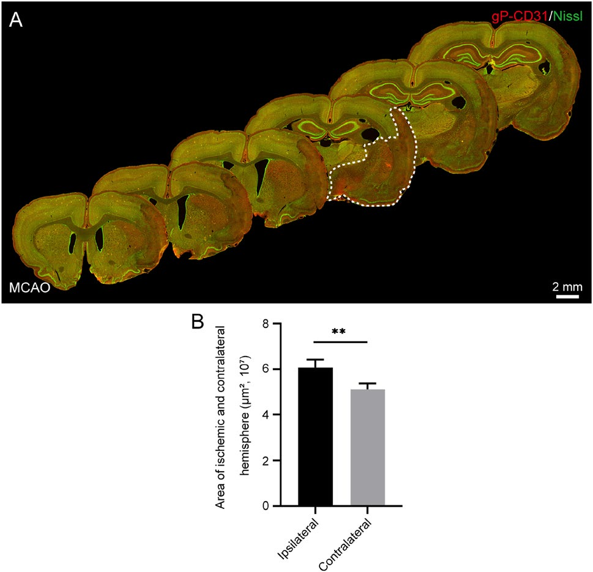
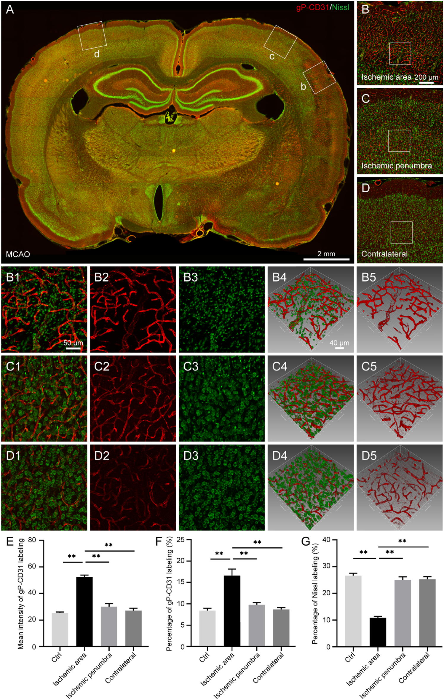
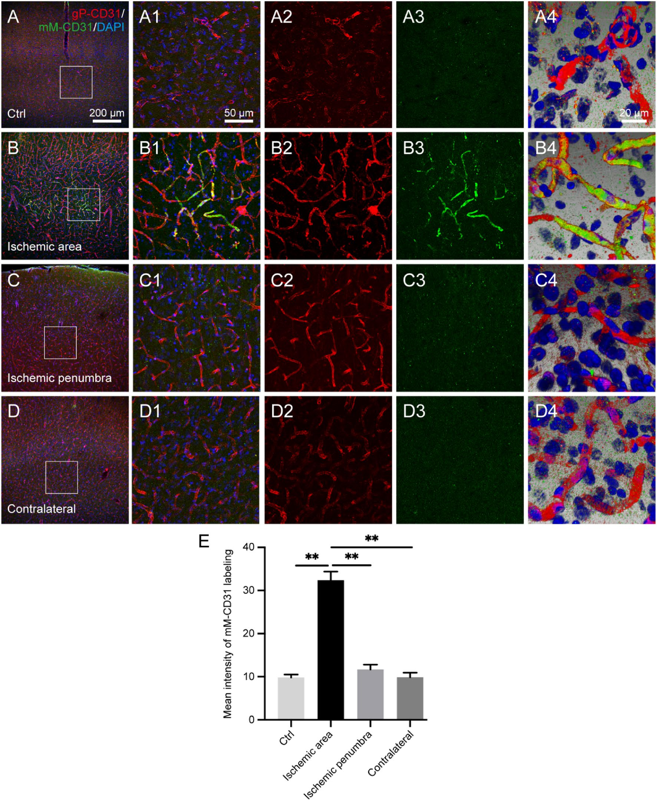
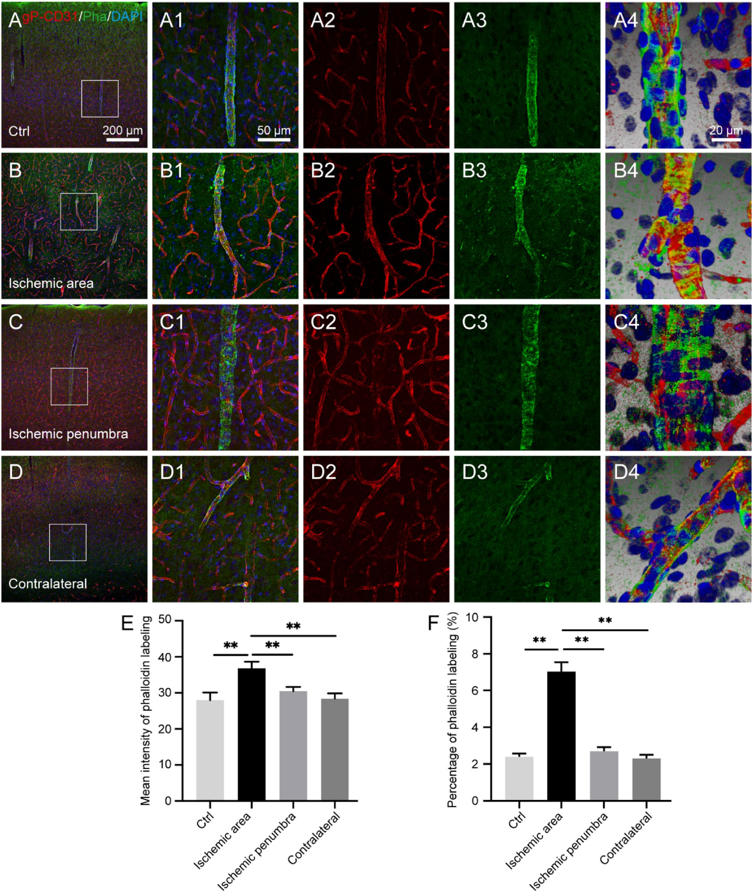
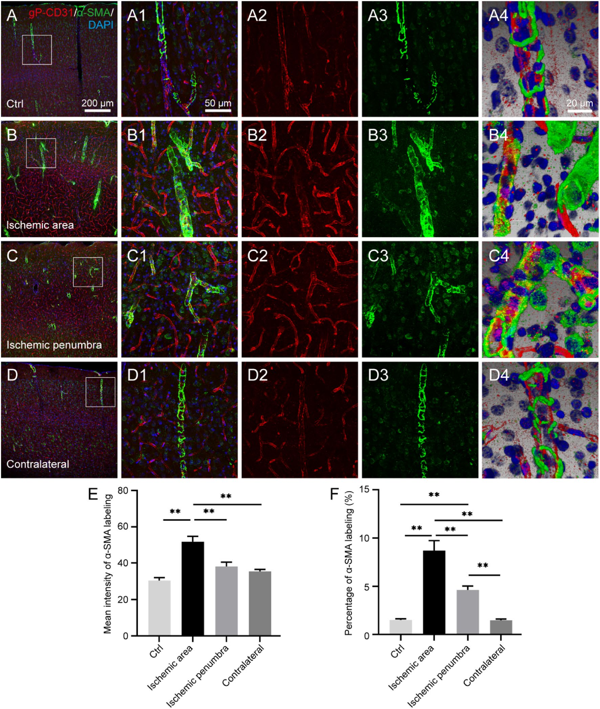
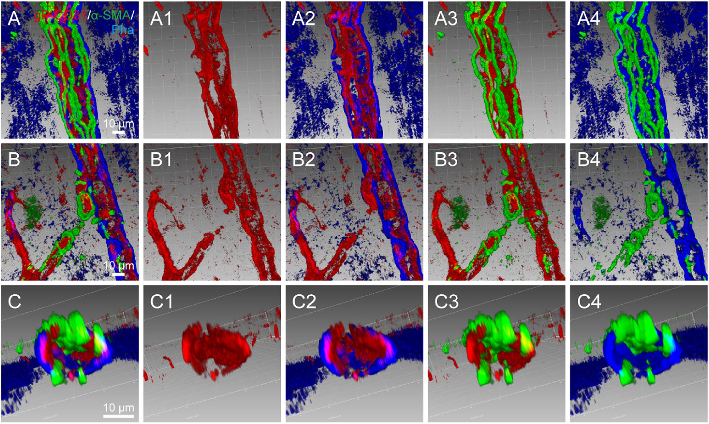

# Figures — Wang et al. 2022

Native-resolution figure images extracted from
[`../wang-2022-cd31-vascular-network.pdf`](../wang-2022-cd31-vascular-network.pdf) with
`references/_tools/extract_pdf_assets.py`. Paper digest: [`../digest.md`](../digest.md).
Cropped sub-panels — including the 16 isolated `VESSEL_` red-channel working images — and the
full inventory: [`panels/README.md`](panels/README.md).

**Panel-naming convention** (Figs 3–6): row letter = region, column number = channel/view —
`1` merged overlay, **`2` = gP-CD31 red (vessels)**, `3` the second marker, `4`(/`5`) 3-D
reconstruction. Scale bars: 2 mm (montage col A), 200 µm (overview col B), **50 µm** (the
`…1/…2/…3` detail panels), 40 µm / 20 µm (3-D panels).

---

## Figure 1 — `fig1_gP-CD31_Nissl_healthy.png`

Healthy brain: coronal montage (A) → cortex overview (B) → detail (C). **C1 = gP-CD31 red
vessels only** — the cleanest vessel example in the paper, and the source of
`panels/VESSEL_fig1_C1_healthy_gP-CD31_red.png`; C2 is the Nissl counterstain, C3/C4 are 3-D
reconstructions of the same field.

## Figure 2 — `fig2_ischemia_regional.png`

Regional change after ischemia/reperfusion: serial coronal montages across the injured
hemisphere plus a hemisphere-area bar chart — the ischemic hemisphere is enlarged relative to
the contralateral side (edema, P<0.05). No isolated vessel-channel panel here; this figure is
whole-section context, not a `VESSEL_` source.

## Figure 3 — `fig3_gP-CD31_Nissl_ischemic.png`

Ischemic brain, three regions side by side: **B** = ischemic core, **C** = penumbra, **D** =
contralateral. **B2/C2/D2 = gP-CD31 red vessels only**, feeding
`panels/VESSEL_fig3_{ischemic,penumbra,contralateral}_gP-CD31_red.png`; column 1 is the merged
overlay, column 3 is Nissl, columns 4/5 are 3-D reconstructions. Panels E–G are the bar charts
(gP-CD31 intensity and area-% peak in the ischemic area; Nissl-% drops there).

## Figure 4 — `fig4_gP-CD31_vs_mM-CD31.png`

gP-CD31 (red) vs mM-CD31 (green) across the four regions, columns **A–D**. **A2–D2 = gP-CD31
red vessels only**, feeding
`panels/VESSEL_fig4_{normal,ischemic,penumbra,contralateral}_gP-CD31_red.png`; column 3 is
mM-CD31, column 4 is the 3-D reconstruction. Panel E is the bar chart: mM-CD31 only labels
capillaries in the ischemic area (P<0.05), while gP-CD31 labels vessels in every region.

## Figure 5 — `fig5_gP-CD31_vs_phalloidin.png`

Same four-region layout as Fig 4, gP-CD31 (red) vs phalloidin (green, penetrating-artery
walls). **A2–D2 = gP-CD31 red vessels only**, feeding
`panels/VESSEL_fig5_{normal,ischemic,penumbra,contralateral}_gP-CD31_red.png`. Phalloidin
wraps the gP-CD31 lumen side on arteries and barely labels capillaries; its area/intensity is
larger in the ischemic region (P<0.05).

## Figure 6 — `fig6_gP-CD31_vs_aSMA.png`

Same four-region layout again, gP-CD31 (red) vs α-SMA (green, artery-wall smooth muscle).
**A2–D2 = gP-CD31 red vessels only**, feeding
`panels/VESSEL_fig6_{normal,ischemic,penumbra,contralateral}_gP-CD31_red.png`. α-SMA forms a
disconnected outer layer around gP-CD31 on artery walls and is sparse on capillaries; stronger
in the ischemic area (P<0.05).

## Figure 7 — `fig7_spatial_correlation_3D.png`

3-D spatial relationship of gP-CD31, phalloidin and α-SMA along and across a penetrating
artery: lumen → gP-CD31 (endothelium) → phalloidin → α-SMA (smooth muscle), largely
independent of one another in capillaries. No isolated vessel-channel panel here — this
figure is the paper's 3-D-relationship argument, not a `VESSEL_` source.
